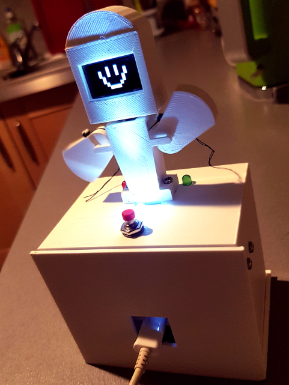

# BOTINO

[](https://jenkins.martinenhome.com/job/botino-arduino/job/master/)

This is a cool-geek-fully-configurable more-than-an-alarm project. 



Use cases: 

- you want to be gently reminded to drink water every 30 minutes in your desk TODO show image notifying you
- you want to be be reminded when to leave work
- you want to create dances and moves freely to use then to play jokes TODO show image dancing
- you want to be notified that today will rain (thanks to IFTTT) TODO show image notifying to you
- you want to keep track of events like when you arrive and when you leave work (thanks to IFTTT) TODO show image of the button

Features:

- 8 fully configurable alarms
- alarms can trigger cool moves on the bot (like arm moves, dances, light shows, fan, images, animations, etc.)
- can provide the random quote of the day (as part of a move)
- can provide random future reading (as part of a move)
- can fire IFTTT events (as part of a move)
- can be fired by IFTTT events
- firmware auto update
- command line via telnet and serial port TODO add image
- power saving deep sleep mode (work in progress, aim at having the device working for months on standard 3xAA batteries)

TODO find a way to explain this all in a simpler manner

## 1. Get Started

### 1.1. Plug It

To get started first connect the module to any standard USB plug.

### 1.2. Set up you WIFI connection

Connect to it via serial port (TODO explain why) and set up your wifi settings via commands (use `help` to get started).

### 1.3. Play with It

Interaction with *Botino* is done via the Internet. You send the setup to the internet via HTTP queries, and *Botino* regularly picks them up. 

You are the boss. You tell *Botino* what to do. There are several settings you can tune. 

*Botino*'s internal components are called actors. Each actor has a precise role, and a set of properties
you can tune to get the behaviour you want.


| Actor name    | Actor description                                                                    | Properties                         |
| ------------- | ------------------------------------------------------------------------------------ | ---------------------------------- |
| settings      | Is in charge of gather general purpose settings, mostly for development purposes.    | [Settings.h](src/actors/Settings.h)|
| body          | This is the core of the alarm, driven by routines triggered at specific moments.     | [Body.h](src/actors/Body.h)        |
| images        | Holds custom images to be used.                                                      | [Images.h](src/actors/Images.h)    |
| ...           |                                                                                      | [...](src/actors/)                 |

Control your botino via the [Main4ino portal](http://martinenhome.com:6780).

# 2. Extras

## Low Power (a.k.a. Deep Sleep mode)

To set it up: 

- ensure file deepsleep.tuning is set to 1
- ensure property settings.+onerun is set to true 

## Telnet

You can telnet the device for debugging purposes. You will get the logs via Wifi. Debug mode must be enabled.

You can also control the device. To do so you need to enter in configuration mode, by sending via telnet the command `conf` (and wait
for the device to pick it up). Then send the command `help` for help.

## Poses

A pose refers to a pose of *Botino*. For instance a LED on, a fan off, a message in the LCD, etc.

A sequence of poses make a move: it can be dances, anymated messages on the screen, images on the screen, a light show, 
an IFTTT event, etc.

Among the poses, *Botino* can trigger IFTTT events. 

### IFTTT connectivity

This connectivity (as both This and That block) allows:

- (as This) to control home artifacts like lights, heaters, etc. via a single button
- (as This) to count events
- (as That) make a move when an Ifttt condition is met (notify with a dance when tomorrow will rain)


Properties: see [here for more information](src/actors/Body.h)

## Tuning

Use the following commands to tune the servos: 

```
init
```

# 3. Contribute

## 3.1. Hardware

For information, the Board used is [NODEMCU / ESP-01](http://www.esp8266.com/wiki/doku.php?id=esp8266-module-family).

- ESP8266 ESP-12E (see a full [list of variants here](https://www.esp8266.com/wiki/doku.php?id=esp8266-module-family))


## 3.2. Software

To prepare your development environment first do:

```
./pull_dependencies
```

The project is a `platformio` project.

### Heads up

When contributing, keep always in mind the best practices: 

- Try not to overuse the heap (only 4K!): prefer static memory allocation rather than dynamic one
- Reuse instances as much as possible

### Eclipse

To get started with _eclipse_ do:
```
platformio init --ide eclipse --board esp12e
```

## 3.3. Upload

To upload the firmware just do: 

```
# upload via USB serial port:

 ./upload -p profiles/dev7-custom.prof -f

To see the logs:
```
# using minicom:
 sudo minicom -D /dev/ttyUSB0 -b 128000 -z -L -l # + Ctrl+a u  (and Ctrl+a q to exit)

# using platformio serial monitor:
 ./serial_monitor 0

```

To upload any tuning folder just do: 

```
upload -p profile -s directory
```

## 3.4. Simulate

Even if the current main implementation uses ESP8266, *Botino* is meant to be multi platform. You can launch it even in your PC:

```
./simulate 0 100 # mode interactive, 100 steps and quit
```

## 3.5. Test

```
./launch_tests
```
